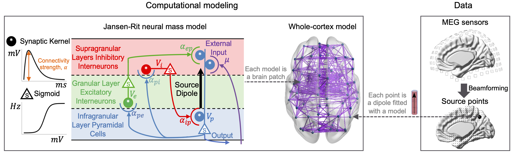

# NeuroProcImager-Plus
#### Yun Zhao, Levin Kuhlmann (Monash University, Australia), Email: yun.zhao@monash.edu, levin.kuhlmann@monash.edu

**NeuroProcImager-Plus** is associated with the manuscript *Cortical local dynamics, connectivity and stability correlates of global consciousness states*.

**NeuroProcImager-Plus**, an extension of **NeuroProcImager** ([Github link](https://github.com/yundumbledore/NeuroProcImager/tree/main), [Neuroimage Paper link](https://www.sciencedirect.com/science/article/pii/S1053811922007078)), explores neurophysiological mechanisms of brain functions regarding effective connectivity between brain regions, regional neurophysiological variables, and dynamic cortical stability analysis.

## Methods

### Modelling the brain

The schematic of the whole-cortex model fitted to source-level MEG data is shown. The left side shows a neural mass model (NMM) and the middle shows the whole-cortex model. Each node in the whole-cortex model is a NMM. Purple lines represent connections between NMMs. The right side shows MEG sensors and reconstructed source points in the cerebral cortex. Each source time series is fitted with a NMM. In this study, MEG source time series are used whereas our framework also applies to EEG data.

Briefly, the NMM comprises three neural populations, namely excitatory (e), inhibitory (i), and pyramidal (p). The pyramidal population (in infragranular layers) driven by the external input $\mu$, excites the spiny stellate excitatory population (in granular layer IV) and inhibitory interneurons (in supragranular layers), and is excited by the spiny stellate excitatory population and inhibited by the inhibitory interneurons. Neural populations are characterized by their time varying mean (spatial, not time averaged) membrane potential, $v_n$ , which is the sum of contributing population mean post-synaptic potentials, $v_{mn}$ (pre-synaptic and post-synaptic neural populations are indexed by $m$ and $n$) and connected via synapses in which the parameter, $\alpha_{mn}$ quantifies the population averaged connection strength. $\alpha_{mn}$ is referred as the regional neurophysiological variables. In the figure above, there are four variables in a cortical region.

Coupling of two cortical regions is achieved by connecting the output of the pyramidal population in one region to the input of the pyramidal population in another region via a synapse. The synaptic connection strength from region $a$ to $b$ is referred as the inter-regional connectivity parameter $w_{ab}$. For the whole-cortex model, the input to the pyramidal population in one cortical region is formed by the combination of post-synaptic membrane potentials induced by the output of each area. 

### Parameter estimation
To estimate parameters of the whole-cortex model from data, we first treat each NMM in the whole-cortex model independent and apply the semi-analytical Kalman filter (AKF) that we developed in [Neuroimage Paper link](https://www.sciencedirect.com/science/article/pii/S1053811922007078) to estimate parameters of each NMM. The AKF is an unbiased estimator, providing the minimum mean square error estimates for model parameters, under the assumption that the underlying probability distribution of the model state is Gaussian. Briefly, the aim of the estimation is to calculate the posterior distribution of model parameters at time point $t$ given measurements up to $t$. This gives time-varying parameter estimates.

To estimate inter-regional connectition strength $w$, we use the multivariate regression model to relate the input of the pyramidal population $mu$ in one region to the output of the pyramidal population in other regions. The bias 

## Demonstration
Here we provide a demonstration to enable reviewers and readers to get in touch with NeuroProcImager-Plus.

**Showcase: Dynamic cortical stability analysis under xenon-induced asymptotic loss of consciousness**

This showcase calculates and shows the time-evolving stability of the cerebral cortex during an xenon-induced anaesthesia experiment where a subject started with wakeful state and slowly lost responsiveness and finally recovered from unconsciousness.

To run this Case, one needs to download "regional_variable_estimates_S11.mat" from [Google Drive](https://drive.google.com/drive/folders/1i8ZqNcqIbl0AMgG1JY3nuSUMqaBCREqD?usp=sharing) and put it in the /Data folder. The time-evolving neurophysiological variables in each region were estimated using [NeuroProcImager](https://github.com/yundumbledore/NeuroProcImager/tree/main) by fitting a neural mass model to each MEG source time series. This demonstration further estimates the inter-regional connectivity parameters, calculates the Jacobi matrices of the whole-cortex model system, and shows the time-evolving eigenvalue spectrum and the number of positive eigenvalues.

This demonstration will run overnight because the recording is half an hour long and the sampling rate is 150Hz. Run time highly depends on the hardware of the CPU workstation.

## Adaptation to your data
Users can prepare EEG or MEG data of the whole brain or part of the brain area, and use our [NeuroProcImager](https://github.com/yundumbledore/NeuroProcImager/tree/main) to estimate the regional neurophysiological variables of each brain region (that is, the region corresponding to each MEG or EEG time series). Assuming there are $N$ regions (i.e., N time series) of length $t$, and each region has $n$ neurophysiological variables, the user needs to save the estimated values ​​in the format of $n$ x $t$ x $N$ and name it "xi_hat_list".
